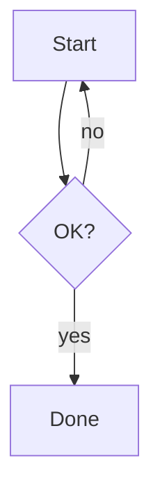

# Markdown Showcase

This note exercises **bold**, *italic*, ~~strike~~, ==highlight==, `inline code`, and a [[Knowledge Base]] link plus a #demo tag.

## Tasks
- [ ] First task
- [x] Done task
- A normal bullet
- [ ] Bullet


## Callout
> [!warning] Heads up
> This is a callout with a [[Welcome]] link inside.

## Table
| Feature | Status |
|---------|--------|
| Tables  | ✅     |
| Math    | ✅     |

## Code
```ts
const x: number = 42;
console.log(x);
```

## Math
Inline $E = mc^2$ and a block:

$$\int_0^\infty e^{-x}\,dx = 1$$

## Diagram


## Embed & image
![[Welcome]]


A block reference here. ^demo-block

---

Footnote test.[^1]

[^1]: The footnote definition.
